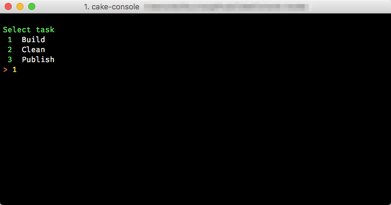

## Interactive Console for Cake (C# Make)

[](https://travis-ci.org/wk-j/cake-console)



## Installation

```
> npm install -g  cake-console
```

## Usage

Start console

```
> cake-console
```

Exit 

```
> CTRL + c
```